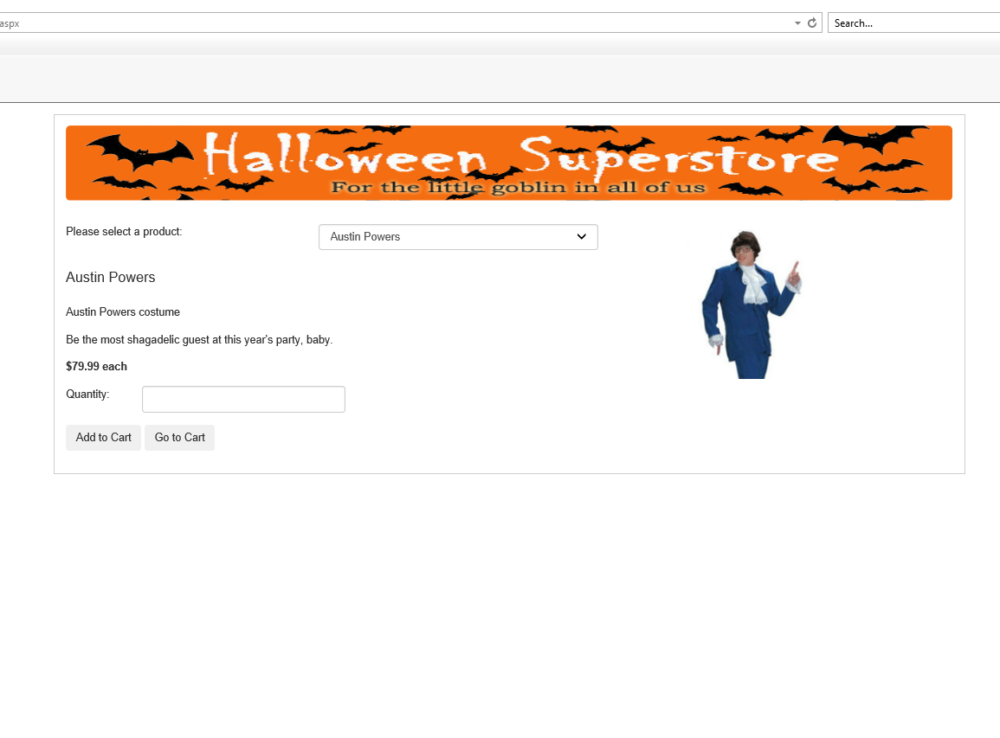

# Halloween Web App
> An ASP.NET web application to shop for halloween products.

## Table of contents
* [General info](#general-info)
* [Screenshots](#screenshots)
* [Technologies](#technologies)
* [Setup](#setup)
* [Features](#features)
* [Status](#status)
* [Inspiration](#inspiration)
* [Contact](#contact)

## General info
The goal of this project is to show my portifolio to the world.

## Screenshots

## Technologies
* ASP.NET
* C#
* HTML
* CSS
* BootStrap
* SQL

## Setup
Visual Studio as IDE

## Features
Features ready:
* Adding products to cart

To-do list:
* Implement the check out function
* 

## Status
Project is: _in progress_

## Inspiration
Project based on graduate school homework assignment.

## Contact
Created by Julius Mushi - feel free to contact me!
